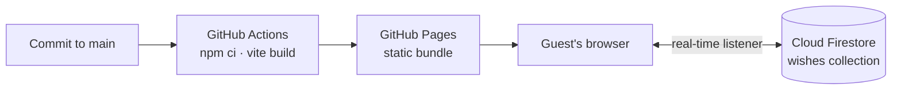

<div align="center">

# ॥ श्री गणेशाय नमः ॥

## साखरपुडा · Vishrut & Hemangi

**A digital invitation for a traditional Marathi Sakharpuda & Ring Ceremony**

*Monday, 21 September 2026 · Hotel Regenta, Vasco-da-Gama, Goa*

<br />

[](https://vishrutman.github.io/VM-HK-Engagement/)
&nbsp;
[](https://github.com/Vishrutman/VM-HK-Engagement/actions/workflows/deploy.yml)


<br />


</div>

---

## About

This repository holds the source for a single-page, mobile-first invitation to the Sakharpuda of **Vishrut** and **Hemangi**. It replaces the printed card with something guests can open from a WhatsApp message: the ceremony details, a live countdown, directions to the venue, one-tap calendar entries, and an **Ashirvad Wall** where family and friends can leave their blessings in real time.

The design draws on Marathi ceremonial tradition — the Ganesha invocation, marigold and jasmine petals, maroon and temple gold — while keeping the interface calm, legible, and fast on an ordinary phone.

---

## The Occasion

| | |
| --- | --- |
| **Ceremony** | साखरपुडा · Sakharpuda & Ring Ceremony |
| **Date** | Monday, 21 September 2026 |
| **Time** | 10:30 AM onwards · Muhurtham 11:00 AM – 12:15 PM, followed by Anand Bhojan |
| **Venue** | Hotel Regenta, Swatantra Path, Vasco-da-Gama, Goa 403802 |
| **Dress code** | Traditional Indian attire or formals |

---

## What Guests Experience

**1. The entrance.** A full-bleed hero with a scroll-driven zoom-and-fade transition. A responsive `<picture>` element serves a landscape crop on wide screens and a portrait crop on phones, so the composition holds on every device.

**2. The formal invitation.** The Ganesha invocation, the couple, both families' names in Marathi and English, and a live countdown pinned to Indian Standard Time regardless of where the guest is opening the link.

**3. Save the date.** One tap adds the ceremony to Google Calendar, or downloads an `.ics` file for Apple Calendar and Outlook with a reminder set for the day before.

**4. Location & directions.** An embedded map, direct links to Google Maps and Apple Maps, and a copy-address button for sharing with a driver.

**5. WhatsApp community.** A link to the guest group for coordination and updates.

**6. The Ashirvad Wall.** Guests write a blessing and it appears for everyone instantly, with a burst of confetti. Each blessing can be honoured with a heart, accompanied by a temple-bell chime.

**Throughout:** gently drifting marigold and jasmine petals, an instrumental soundtrack that begins on the guest's first interaction, and a sticky quick-action bar on mobile for Directions, WhatsApp, and Calendar.

---

## Architecture



The site is a fully static React bundle. The only dynamic component is the Ashirvad Wall, which reads and writes directly to Cloud Firestore from the browser. There is no server to maintain.

---

## Tech Stack

| Layer | Choice |
| --- | --- |
| Framework | React 19 with TypeScript |
| Build tool | Vite 6 |
| Styling | Tailwind CSS 4 |
| Animation | Motion, canvas-confetti |
| Icons | Lucide |
| Data | Cloud Firestore (named database) |
| Hosting | GitHub Pages, deployed by GitHub Actions |
| Typography | Cinzel · Cormorant Garamond · Plus Jakarta Sans |

---

## Design Language

| Swatch | Hex | Role |
| --- | --- | --- |
|  | `#9E2A2B` | Kumkum maroon — headings, primary actions |
|  | `#D4AF37` | Temple gold — ornaments, dividers, accents |
|  | `#5A5A40` | Banana-leaf olive — calendar and hero buttons |
|  | `#E07A5F` | Marigold coral — highlights |
|  | `#FAF7F2` | Parchment cream — page background |

---

## Project Structure

```text
VM-HK-Engagement/
├── .github/workflows/deploy.yml   # Build and deploy to GitHub Pages
├── public/assets/                 # Hero crops, Ganesha motif, OG preview, soundtrack
├── src/
│   ├── App.tsx                    # Page composition and mobile action bar
│   ├── components/
│   │   ├── GopuramHero.tsx        # Hero entrance with scroll transition
│   │   ├── FormalInvitation.tsx   # Invocation, families, date, calendar actions
│   │   ├── CountdownTimer.tsx     # Live countdown in IST
│   │   ├── LocationSection.tsx    # Map embed, directions, copy address
│   │   ├── WhatsAppCommunity.tsx  # Guest group link
│   │   ├── GuestWishes.tsx        # Ashirvad Wall (Firestore)
│   │   ├── FloatingPetals.tsx     # Ambient petal animation
│   │   ├── PersonalizeModal.tsx   # Editor-only detail overrides
│   │   └── InvitationFooter.tsx
│   ├── data/eventData.ts          # Single source of truth for event details
│   ├── lib/firebase.ts            # Firebase and Firestore initialisation
│   └── utils/
│       ├── audioSynth.ts          # Background music and temple bell
│       └── calendar.ts            # Google Calendar URL and .ics generation
├── firestore.rules                # Reference copy of the security rules
├── DEPLOY.md                      # Detailed deployment notes
└── index.html                     # Metadata and social preview tags
```

---

## Updating the Invitation

Every guest-facing detail — names, families, date, time, venue, map links, dress code, WhatsApp link, and coordinators — lives in **`src/data/eventData.ts`**. Change it there and every section, the countdown, and both calendar exports update together.

The event time is written once as `DEFAULT_ISO_DATE` and converted to a timestamp pinned to IST (UTC+05:30), so the countdown and calendar entries stay correct for guests in any time zone.

**Editing from the browser:** open the file on GitHub, click the pencil icon, make the change, and commit to `main`. The site redeploys automatically within a couple of minutes; progress is visible in the **Actions** tab.

---

## Running Locally

Requires Node.js 20 or later.

```bash
npm install
npm run dev        # http://localhost:3000
npm run build      # Production build in dist/
npm run lint       # Type-check with tsc
```

To connect the Ashirvad Wall locally, create `.env.local` in the project root:

```bash
VITE_FIREBASE_API_KEY=your-key-here
```

---

## Deployment

Every push to `main` triggers `.github/workflows/deploy.yml`, which installs dependencies, builds with the correct base path for the repository, and publishes to GitHub Pages.

| Variable | Source | Purpose |
| --- | --- | --- |
| `VITE_BASE` | Derived from repository name | Asset path prefix for the Pages subdirectory |
| `VITE_SITE_URL` | Derived from owner and repository | Absolute URL for social preview tags |
| `VITE_FIREBASE_API_KEY` | Repository secret | Firebase web API key, injected at build time |

See [`DEPLOY.md`](DEPLOY.md) for custom domains and for testing a subdirectory build locally.

---

## Security Notes

Firebase web API keys identify a project; they do not authorise access. Keeping the key in a repository secret keeps it out of source control, but it is still present in the built JavaScript by design. The real protection lies elsewhere:

- **Firestore security rules** permit anyone to read blessings and to create new ones only within strict field, type, length, and timestamp limits. Existing blessings can be updated only by incrementing the like count by one, and nothing can be deleted from the client.
- **API key restrictions** in Google Cloud limit the key to the required APIs and to requests originating from `vishrutman.github.io`.

`firestore.rules` in this repository is a reference copy. Rules take effect only once published in the Firebase Console against the named database.

---

## Accessibility & Performance

- Respects `prefers-reduced-motion` for ambient animation.
- Audio never autoplays; it begins on the guest's first interaction and pauses when the tab is hidden.
- Hero imagery is served as WebP in separate crops for portrait and landscape screens.
- Below-the-fold images load lazily.
- Designed and tested mobile-first, since most guests will open the link from WhatsApp.

---

## Credits

- Background score: *Tere Bina* (instrumental), composed by A.R. Rahman. All rights belong to the respective rights holders; used here for a private family occasion.
- Typefaces from Google Fonts. Icons by [Lucide](https://lucide.dev).
- Designed and built with the help of Claude by Anthropic.

---

<div align="center">

**शुभं भवतु**

*With the blessings of both families, we look forward to celebrating with you.*

<sub>A personal project. The code is shared for reference; names, photographs, and event details are private and not licensed for reuse.</sub>

</div>
